# Plants vs. Zombies DH Version
🔷 [Video giới thiệu game](https://www.youtube.com/watch?v=0jItQVLUEfA)
# Giới thiệu
🔷 Lũ Zombie đang xâm chiếm ngôi nhà của bạn, để chống lại điều đó bạn sẽ dùng những loại cây cối! Nhiệm vụ của bạn là dùng sự sáng tạo của bản thân để chiến thắng. Ngoài những level và địa hình truyền thống, tôi sẽ cung cấp thêm nhiều điều mới để khiến game thú vị hơn. Cùng chờ đón nhé!!  
📌 Phần 1: Tải game và tải source code  
📌 Phần 2: Cách chơi game  
📌 Phần 3: Giới thiệu TD và Mini-Game  
📌 Phần 4: Almanac  
📌 Phần 5: Về texture, nhạc module và file json    
___
### Phần 1: Tải game và tải source code
⚠️ Chú ý: Mặc dù game 32-bit nhưng tôi không khuyến khích chạy game trên máy 32-bit bởi vì:  
● Máy 32-bit hỗ trợ tối đa 4GB RAM và khi mở game, game sẽ load texture và sẽ chiếm khoảng 1,4GB hoặc hơn. Vì vậy khi mở game lên chắc chắn máy sẽ bị lag thậm chí crash game ngay lập tức.  
● Lý do: Texture lấy từ game gốc, không cắt giảm, không giảm bớt frame.  
⚠️ Do đó tôi khuyến khích dùng máy 64-bit, có tối thiểu 8GB RAM   
📌 Đối với những người chỉ tải về để trải nghiệm   
💡 Cách 1: Bạn có thể clone code về, giải nén sau đó vào thư mục Debug và chạy file exe   
💡 Cách 2: Tải bản đóng sẵn qua đường link sau   
📌 Đối với những người cần đọc code(như giảng viên)   
💡 Ta vẫn clone code về máy bình thường, tuy nhiên nên dùng "Visual Studio" trong việc liên kết lại thư viện và biên dịch
___
### Phần 2: Cách chơi game
**Khi vào game sẽ ra màn hình sau, hãy bấm start để bắt đầu**   
   
**Ở màn hình này bạn sẽ chọn chế độ tương ứng**   
   
**Khi bạn chọn chế độ TD**   
**Đây là East Sea Dragon Palace(东海龙宫)**   
   
**Khi bạn chọn chế độ Mini-Game**   
   
**Hãy chọn level tương ứng bạn muốn chơi, tôi sẽ giới thiệu các level trong Phần 3**   
**Đây là giao diện chọn cây, hãy chon 6 cây và bấm bắt đâu**  
   
**Khi bắt đầu game, bạn hãy trồng cây phòng thủ, đừng để zombie vào nhà**   
   
**Khi chiến thắng, sẽ có nhạc và level sẽ tự thoát ra**   
**Nếu thua, một màn hình sẽ hiện ra**   
   
**Tính năng phụ**   
**Khi bạn trồng đè 2 con Peashooter vào nhau thì bạn thu được Repeter**  
 ➡️    
**Khi bạn trồng đè 2 con Sunflower vào nhau thì bạn thu được Twin Sunflower**  
 ➡️    
___   
### Phần 3: Giới thiệu TD và Mini-Game   
- **Phần TD**   
Bối cảnh của phần TD là "East Sea Dragon Palace" hay dịch sang tiếng việt là "Đông Hải Long Cung"   
Do bối cảnh lấy ở dưới biển, nên sẽ không có oxy, nếu bạn trồng cây mà không có sự hỗ trợ của 氧气藻, cây của bạn sẽ tự chết sau một thời gian [Video minh họa](https://youtube.com/)
- **Phần Mini-Game**   
Theo thứ tự ta sẽ có 5 Mini-Game
  - Air-Raid(壮植凌云)   
  - Zombotany I(植物僵尸I)   
  - Swap I(变换I)   
  - Fog??(多雾路段??)   
  - Dark Stormy Night(暴风雨之夜)

**Tôi sẽ không giới thiệu các Mini-Game này có những gì, bạn hãy tự trải nghiệm nhé**  
**Đối với giảng viên muốn xem thay vì tự chơi thì đây là video [Video TD](https://youtu.be/LuyEkRvgs3c) [Video Mini-Game](https://www.youtube.com/playlist?list=PLFpuWA25uKWuOtmk65pGi-wJQdsrS00Y)**   

___
### Phần 4: Almanac
#### 🌱 Plant
| Tên    | Hình Ảnh    | Giá    | Công dụng    |
|----------|----------|----------|----------|
| Peashooter|| 100| Bắn viên đậu gây 20 sát thương|
| Repeater|| x| Bắn hai viên đậu|
| Sunflower| | 50| Tạo 1 mặt trời|
| Twin Sunflower| | x| Tạo 2 mặt trời|
| Wall-Nut| 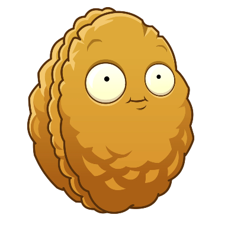| 50| Với lượng máu trâu, Wall-Nut sẽ giúp bảo vệ hàng phòng thủ|
| Potato-Mine| | 25| Potato-Mine sẽ nổ gây 1800 sát thương khi zombie đến gần ở trạng thái kích hoạt|
| Cherry Bomb| 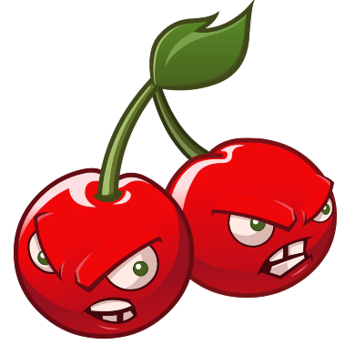| 150| Cherry Bomb khi đặt ra sẽ nổ gây 1800 sát thương trong phạm vi 3x3|
| Butter Shooter| | 175| Bắn đạn gây 20 sát thương kèm hiệu ứng đẩy lùi|
| 氧气藻| | 50| Cung cấp oxi cho cây trong phạm vi 3x3|
| 强酸柠檬| | 175| Bắn hai giọt nước chanh gây 15 sát thương khi zombie không có giáp, 30 sát thương khi zombie có giáp|
| 石榴| 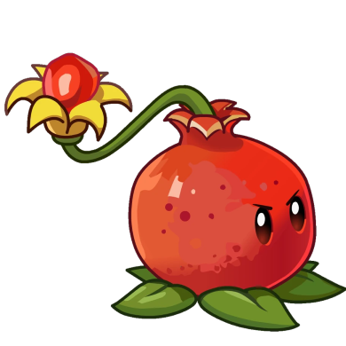| 225| Ném hạt lựu vào zombie gây 100 sát thương|
| 芭蕉| 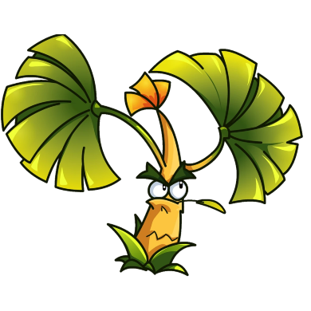| 175| Ném hai lá chuối, hai lá chuối có thể xuyên thấu zombie(Cây không được sử dụng)|
#### 🧟 Zombie
| Tên     | Hình ảnh | Máu | Tác dụng           |
|---------|----------|-----|---------------------|
|Zombie| 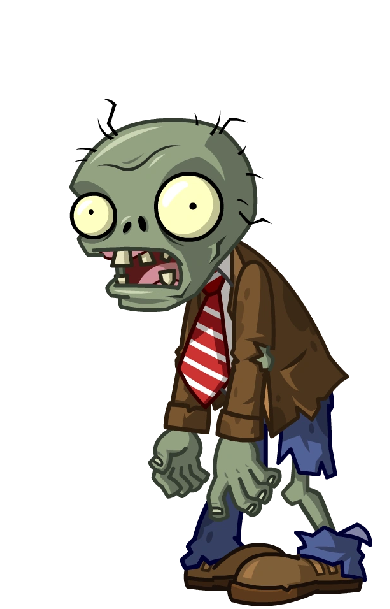 | Máu cơ thể: 270   Máu giáp: 0 | Tấn công cây của bạn |
|Conehead Zombie|  | Máu cơ thể: 270   Máu giáp: 370  | Tấn công cây của bạn |
|Flag Zombie| 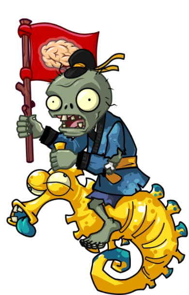 |Máu cơ thể: 470   Máu giáp: 0 | Đi đầu trong đợt tấn công lớn |
|Explorer Zombie| 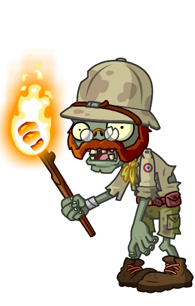 | Máu cơ thể: 470   Máu giáp: 0 | Đốt chết cây ngay khi chạm vào |
|Balloon Zombie| 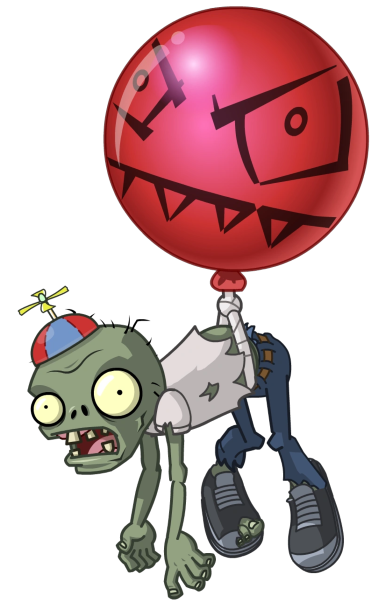 | Máu cơ thể: 270   Máu giáp: 0  | Zombie bay trên trời, tốc độ di chuyển nhanh hơn|
|Jack-in-the-Box Zombie| 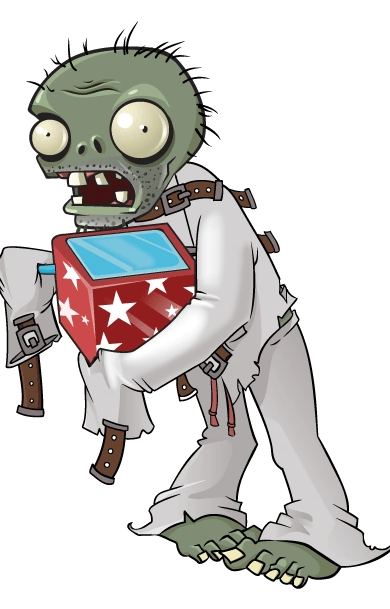 | Máu cơ thể: 470   Máu giáp: 0 | Bình thường zombie cầm hộp quà và quay, khi đến gần cây nó sẽ nổ chết cây trong phạm vi 3x3 |
|Pilot Zombie| 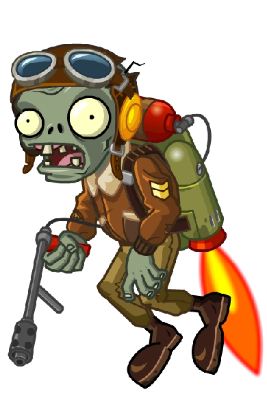 | Máu cơ thể: 270   Máu giáp: 0 |Zombie bình thường của 天空之城(Sky City) |
|Zomboni| 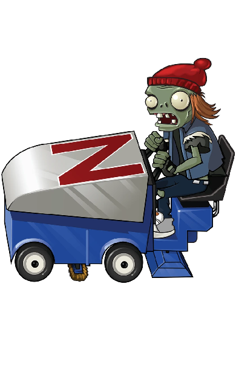 | Máu cơ thể: 750   Máu giáp: 0 |Di chuyển với một chiếc xe, đến gần cây sẽ đè chết cây ngay lập tức|
|Peashooter Zombie|  | Máu cơ thể: 370   Máu giáp: 0  |Bắn viên đậu vào cây|
|Sunflower Zombie|  | Máu cơ thể: 370   Máu giáp: 0  |Tạo mặt trời xanh lá   Mặt trời xanh lá bị cưỡng chế thu và trừ 25 sun|
___
### Phần 5: Về texture, nhạc module và file json   
- **Mục 1: Texture**
  - **Mục 1.1: Các nguồn texture**   
    Tôi sử dụng nguồn texture rất đa dạng như Baidu, PVZ ONLINE, PVZ2, PVZ2 CHINESE VERSION.   
    **Đây là các nguồn**   
    [Baidu I](https://tieba.baidu.com/p/8214408337?pn=1)   
    [Baidu II](https://tieba.baidu.com/p/8877907058?pn=1)   
    [PVZ ONLINE](https://github.com/map220v/TencentPvZOL/releases/)   
    [PVZ2](https://www.apkshub.com/app/com.ea.game.pvz2_row)   
    [PVZ2 CHINESE VERSION](https://decrypt.day/app/id597986893)   
    PVZ PC(Sử dụng Assembly)
  - **Mục 1.2: Cách làm spritesheet**   
    Đối với các nguồn Baidu, tải gif về.
    
    Đối với nguồn PVZ ONLINE, sử dụng "JPEXS Free Flash Decompiler" xuất file swf thành file gif.
    
    Đối với nguồn PVZ2 và PVZ2 CHINESE VERSION ta sẽ phải dùng một công cụ mang tên [Sen(Lotus)](https://github.com/harumazzz/Sen).
    
    - **Mục 1.2.1: Đối với texture của PVZ2 và PVZ2 CHINESE VERSION**   
      Hai file main.rsb hay main.obb đều như nhau, ta sẽ sử dụng Sen để giải nén ra.
      
      Sau khi giải nén ta sẽ thu được các folder chưa âm thanh game, texture game,...
      
      Ta sẽ tìm xem mình muốn làm texture gì, từ đó chọn file "scg" phù hợp.   
      
      Ta lại dùng Sen giải nén file scg ra, khi đó sẽ thu được folder, vào folder tìm file main.xfl.
      
      Sử dụng **Adobe Animate** mở file main.xfl sau đó chỉnh sửa các frame bạn muốn sử dụng.
      
      Xuất file gif qua **Adobe Animate**, nhớ xuất dạng Transparent.   

      Nếu thấy khó hiểu thì video này dành cho bạn [Video](https://github.com/harumazzz/Sen).   
    - **Mục 1.2.2: Đối với texture của PVZ PC**   
      Hãy xem video vì nó liên quan đến code [Video](https://youtu.be/ulIeEyo9L1A)
      
    Sau khi có file gif thì hãy dùng [Ezgif](https://ezgif.com/gif-to-sprite) để tạo file spritesheet.   
- **Mục 2: Nhạc Module**   
  Mặc dù SDL có hỗ trợ đọc file ".xm", tuy nhiên các tính năng được import vào không đầy đủ.
  
  Vì vậy trong dự án này tôi có dùng thêm một thư viện phụ là "libxmp".
  
  "libxmp" là một thư viện cho phép giải mã file nhạc module, tuy nhiên chức năng phát nhạc lại không có.
  
  Chúng ta sẽ dùng "libxmp" để giải mã và liên kết với SDL_Mixer để phát nhạc.
  
  Đây là mã nguồn [Code](https://xmp.sourceforge.net/libxmp.html#sdl-example).
  
- **Mục 3: File Json**   
  Tôi sử dụng thêm thư viện "nlohmann/json" [Link Github](https://github.com/nlohmann/json).
  
  **Trong github sẽ có đầy đủ hướng dẫn cách đọc file.
  
  Mục đích tôi dùng thư viện này để đọc file json. Giúp spawn zombie dễ dàng hơn so với việc viết code cứng.
  
    
    
    

